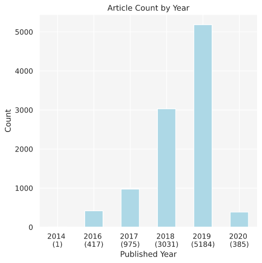
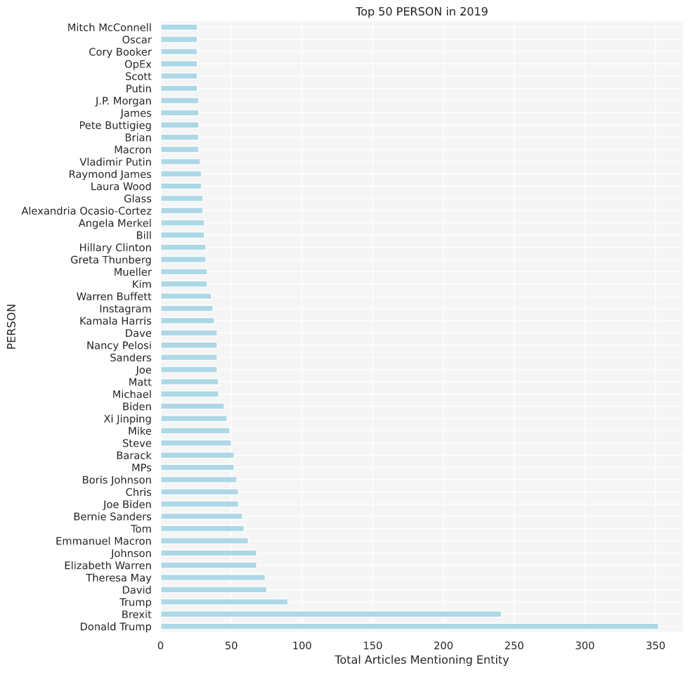
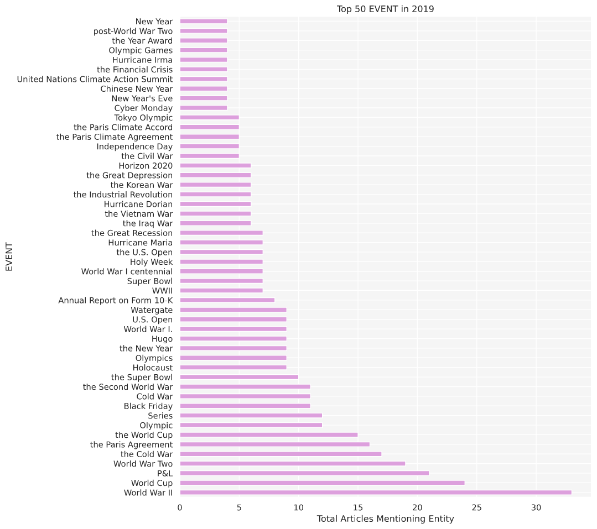
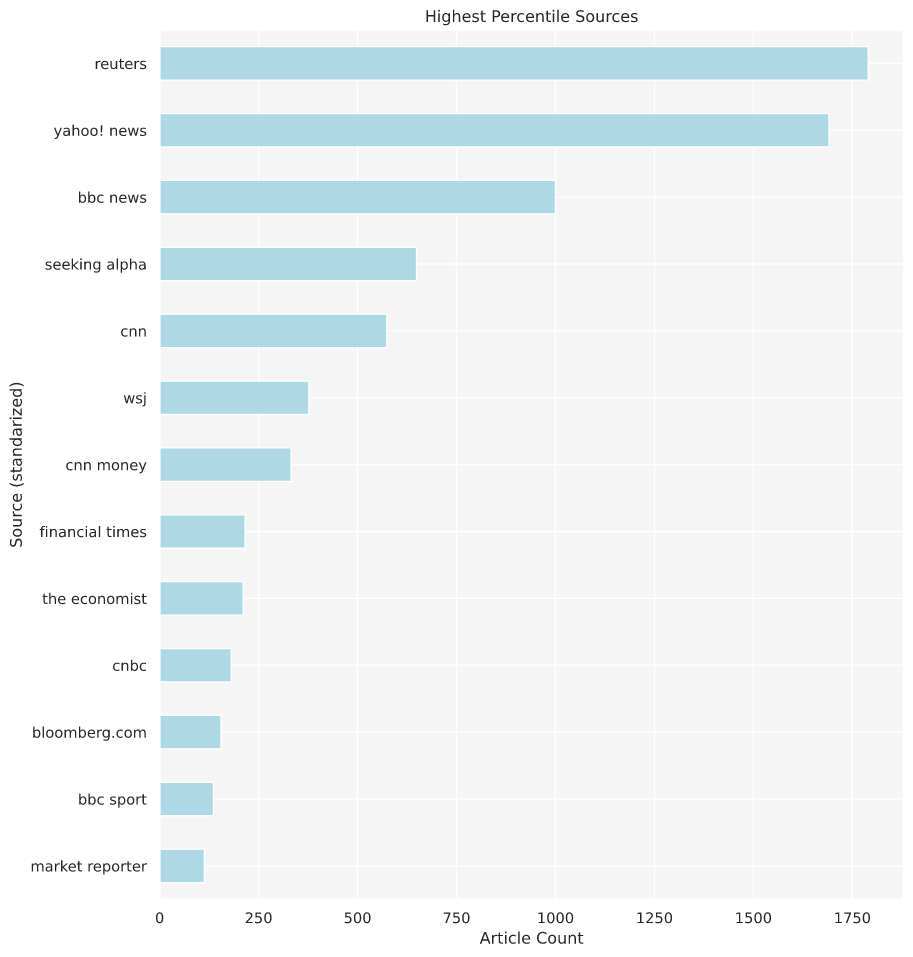

# Article Analysis Project


Prepared by: [Leah Pope](https://www.linkedin.com/in/leahspope/)


# Introduction
The goal of this project is to perform an Exploratory Data Analysis on a ~10,000 article dataset and provide some useful insights.

Using the OSEMN Process to conduct Exploratory Data Analysis. OSEMN stands for Obtain, Scrub, Explore, Model, and iNterpret. All stages of the process are used for Machine Learning projects. 

This is an Exploratory Data Analysis project and uses only the Obtain, Scrub, Explore steps to discover insights about the Environmental, Societal, and Governance (ESG) Article dataset.

More details on OSEMN found here: https://machinelearningmastery.com/how-to-work-through-a-problem-like-a-data-scientist/ 

# Data Description and Preparation
Originally provided data was ~10,000 json files containing articles related to a search on Environmental, Societal and Governance (ESG) terms. The following steps were taken to obtain the data used in this analysis:
- Articles were ingested into a MongoDB by a process that also obtained metatdata for each article (wordCount, lists of Entities, entityMentions, standardized source name). See populateMongo.py and nlpActions.py for this code.
- Articles to be analysed are retrieved from the document store (MongoDB)
- Even though some preprocesing was done, some data cleaning/scrubbing was applied.

See the [Analysis Notebook](./code/analysis.ipynb) for code and analysis. 


# EDA Questions Explored


## Exploration Point 1 : The Year with the most Articles
#### 2019 had the most articles (5184 in total).
#### What might be interesting about these ESG articles. Exploring PERSON and EVENT entities mentioned in these articles might provide context/insight.




### Insights
#### Politicians\World Leaders dominated PERSON entity mentions in the 2019 Articles in the dataset.
- This is not surprising since the articles were taken from AMPLYFI's harvest engine in relation to Environmental, Societal and Governance (ESG) terms.



#### The EVENT entity mentions also appear to be in alignment with an ESG search
- Sporting Events: Olympic Games, World Cup, U.S. Open, Super Bowl
- Annual Events: Cyber Monday, Black Friday, New Year, Chinese New Year, Holy Week, Independence Day
- Historic events: he Financial Crisis, the Civil War, Great Depression, the Korean War, Industrial Revolution, the Vietnam War, the Iraq War, Word War I, Watergate, Holocaust, the Cold War, World War II
- Climate and Science Events: Hurricanes Irma and Dorian and Maria and Hugo, the Paris Climate Accord, Horizon 2020, United Nations Climate Action Summit 



#### Why is WW II mentioned so often in 2019?
- A short Google research session reveals that the 75th Anniversary of D-Day occured in June and the 80th Anniversary of the start of WW II was in September.

### Additional Insights
#### The current Entity Extraction tool (SpaCy) could be improved or replaced with a better version.
- Instagram and Brexit should not be considered Person entities
#### A Entity Resolution tool would be helpful for future analysis.
- If analysis are searching for Entities using "keyword" searches, they should be aware of the different ways Entities can be mentioned. 
- Various GPE representations for the United States exist (the United States, United States, U.S. USA, US) so being aware of variations could help analysts create a better keyword search term list.


### Exploration Point 2: Sources
#### How might we analyse and compare all the Sources? Comparing by article count per source seems to be a good place to start.


### Insights
#### The Sources in the chart below are the in the Top 1% of this dataset (based on Article Count)
- If an organization had to prioritize their Source costs (such as subscriptions/API/access fees), they might want to focus their spending on the Sources with the most ESG articles. 
- Reuters and Yahoo! News are top ranked. There may be considerable overlap in news stories as they are both general/worldwide news outlets. If analysis time was limited - it might be advantagous to choose one of these two to inspect.




# Future Work
* Explore mentions of other Entity types (GPE, LAW, ORG, etc.)
* Compare counts of articles from similar sources (ex: compare counts between world-wide, general news sources or specialized sources such as financial or political news sources).
* Conduct Topic Modelling on Sources of interest - both entire Source results and results in interesting date ranges.


# Repository Structure
```
--code
----analysis.ipynb (Notebook for EDA)
----mongoActions.py (Queries restricted-access, cloud-based MongoDB collection)
----nlpActions.py (Applies NLP tasks to include entity detetion)
----populateMongo.py (Reads in and processes original json files and populates the restricted-access, cloud-based MongoDB collection)
--data 
----sample.json (sample file to see how original article files are structured. All data was stored in a cloud-based MongoDB collection.)
--images (dir for images)
```

# For More Information
* Contact the author [Leah Pope](https://www.linkedin.com/in/leahspope/)
